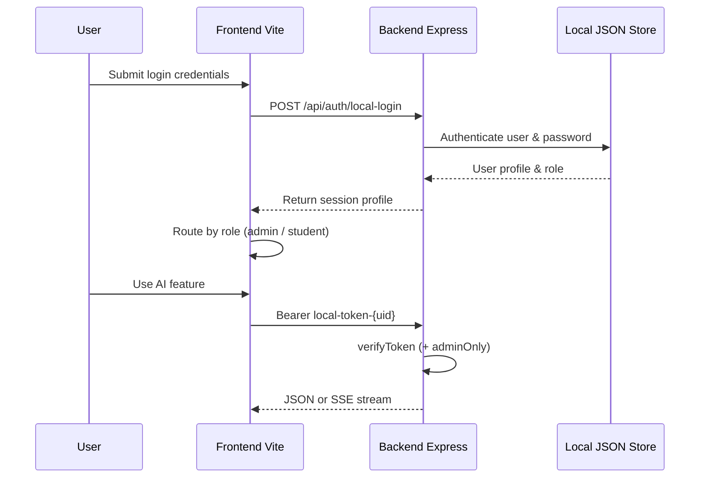

# AI Sajan Shah (`ai01`)

Personal AI mentoring platform inspired by **Sajan Shah** — memory coaching, goal setting, career guidance, and student management.

**Repository:** [github.com/Bwiktechnologies/ai01](https://github.com/Bwiktechnologies/ai01)

---

## Overview

| Layer | Stack |
|--------|--------|
| Frontend | React 19, Vite 8, React Router 7, Tailwind CSS 4, Framer Motion, Lucide, Recharts |
| Backend | Node.js, Express 4, OpenAI, SendGrid |
| Data / Auth | Server-backed JSON Store (`localStore.js`) |

### Roles

- **Student** — AI chat mentor, memory linking (stories), career AI, Brain Gym, goals, hacks, profile
- **Admin** — student CRUD, CSV bulk upload, analytics, email logs, content/settings

---

## System workflow

```mermaid
flowchart TD
  A[User opens /login] --> B[Enter Email & Password]
  B --> C[Post /api/auth/local-login]
  C --> D{Valid credentials?}
  D -->|No| E[Show error message]
  D -->|Yes| F{role}
  F -->|admin| G[/admin dashboard]
  F -->|student| H{onboardingComplete?}
  H -->|No| I[/onboarding]
  H -->|Yes| J[/student app]
  J --> K[Chat / Linking / Career / Brain Gym]
  K --> L[Express API + OpenAI]
```

### Auth & routing flow



---

## Project structure

```
ai01/
├── frontend/                 # Vite + React SPA
│   ├── src/
│   │   ├── pages/            # Login, Onboarding, student/*, admin/*
│   │   ├── components/       # Layout, auth guards, chat, UI
│   │   ├── contexts/         # AuthProvider, ThemeContext
│   │   ├── utils/            # api.js
│   │   └── App.jsx           # Routes
│   └── .env.example
└── backend/                  # Express API
    ├── server.js             # Routes & Express server
    ├── middleware/           # verifyToken, adminOnly
    ├── services/             # openai, sendgrid, localStore
    └── .env.example
```

---

## Key routes

### Student (`ProtectedRoute`)

| Path | Feature |
|------|---------|
| `/student` | Dashboard |
| `/student/chat` | AI Sajan chat (streaming) |
| `/student/paragraph-tool` | Memory story / Linking |
| `/student/career` | Career path analysis |
| `/student/neuroscience` | Brain Gym |
| `/student/goals`, `/roadmaps`, `/mental-health`, `/life-hacks`, `/study-hacks`, `/profile` | Mentoring content |
| `/onboarding` | First-time profile setup |

### Admin (`AdminRoute`)

| Path | Feature |
|------|---------|
| `/admin` | Analytics dashboard |
| `/admin/students` | List / manage students |
| `/admin/add-student` | Create student + welcome email |
| `/admin/upload-csv` | Bulk upload |
| `/admin/email-logs` | Email history |
| `/admin/prompt-editor`, `/content`, `/settings` | Content & settings |

---

## API endpoints

| Method | Path | Auth | Description |
|--------|------|------|-------------|
| `GET` | `/api/health` | — | Health check |
| `POST` | `/api/auth/local-login` | — | Email/Password login |
| `POST` | `/api/chat` | Token | Mentor chat (SSE) |
| `POST` | `/api/memory-story` | Token | Memory story from text |
| `POST` | `/api/career/analyze` | Token | Career roadmap JSON |
| `POST` | `/api/braingym/score` | Token | Save Brain Gym XP |
| `POST` | `/api/student/activity` | Token | Activity ping |
| `GET` | `/api/admin/stats` | Admin | Dashboard stats |
| `GET` / `POST` | `/api/admin/students` | Admin | List / create |
| `DELETE` | `/api/admin/students/:id` | Admin | Remove student |
| `POST` | `/api/admin/bulk-upload` | Admin | CSV bulk create |
| `GET` | `/api/admin/email-logs` | Admin | Email logs |

Default API port: **5000** (`PORT` in `backend/.env`).  
Frontend base URL: `VITE_API_BASE_URL` (see `frontend/src/utils/api.js`).

---

## Setup

### 1. Clone

```bash
git clone https://github.com/Bwiktechnologies/ai01.git
cd ai01
```

### 2. Backend

```bash
cd backend
cp .env.example .env
npm install
npm run dev
```

Configure in `backend/.env`:

- `PORT=5000`
- `OPENAI_API_KEY`
- `SENDGRID_API_KEY` / `SENDGRID_FROM_EMAIL`
- `DEV_AUTH=true`

### 3. Frontend

```bash
cd frontend
cp .env.example .env
npm install
npm run dev
```

Configure in `frontend/.env`:

- `VITE_API_BASE_URL=http://localhost:5000`

App: **http://localhost:5173**

---

## Default Login Credentials

- **Student**: `ashutoshshekhar37@gmail.com` / `Ashutosh@1234sa`
- **Admin**: `admin@aisajanshah.com` / `Admin@1234sa`

---

## Scripts

| Location | Command | Purpose |
|----------|---------|---------|
| `backend` | `npm start` | Run API |
| `backend` | `npm run dev` | Nodemon dev reload  |
| `frontend` | `npm run dev` | Vite dev server |
| `frontend` | `npm run build` | Production build |
| `frontend` | `npm run preview` | Preview build |

---

## License

Private / organizational use — [Bwiktechnologies](https://github.com/Bwiktechnologies).

